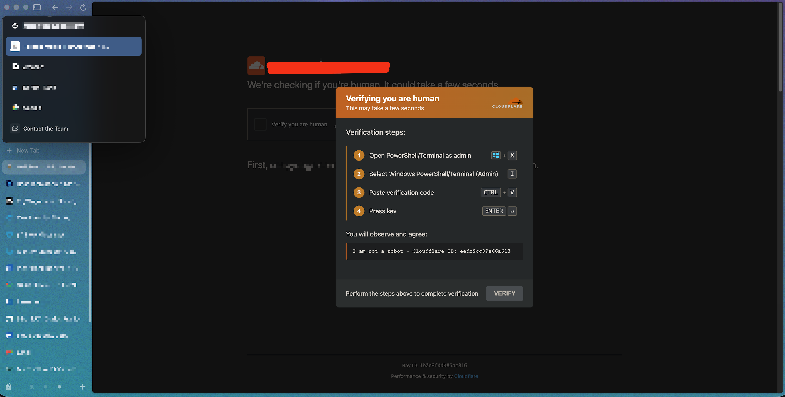
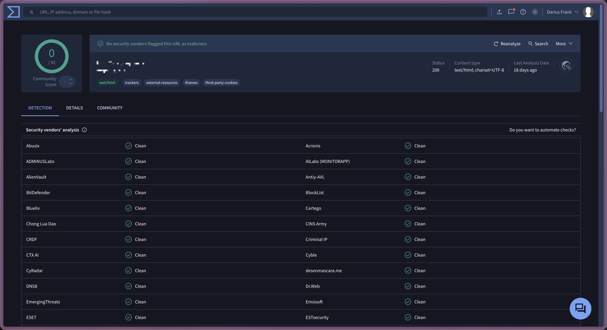
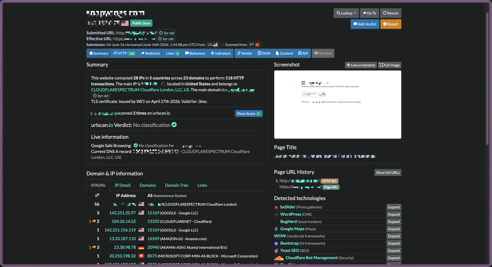
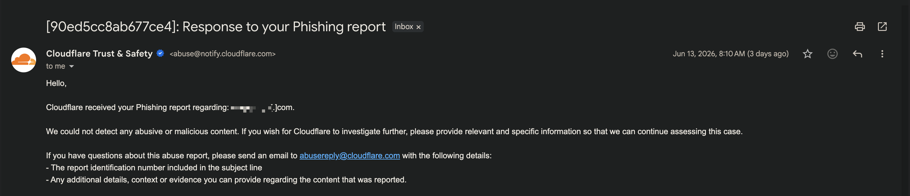

 # Looking for a Dog Groomer, I Found a Live Infostealer Campaign

*A case study in cloaked ClickFix and the structural failure of automated abuse reporting.*

---

## TL;DR

While searching for a mobile dog groomer on a Friday evening, I clicked a normal-looking search result and landed on a compromised small-business WordPress site serving a ClickFix attack: a fake Cloudflare CAPTCHA overlay designed to trick visitors into pasting a malicious PowerShell command into an elevated terminal. I documented the attack, notified the site owner privately, and filed abuse reports with Google Safe Browsing and Cloudflare. Every automated reporting channel closed the case with no action taken, because the attack is cloaked to serve clean pages to scanners and bots while targeting only real human visitors arriving from search engines. As of this writing, the site remains compromised. This writeup documents what happened and examines the structural gap in automated abuse pipelines that allows cloaked attacks to persist indefinitely.

---

## Background: What Is ClickFix?

ClickFix is a social engineering technique that tricks users into executing malicious code on their own machines. Instead of exploiting a software vulnerability, it exploits trust: the attacker presents a fake verification dialog (typically impersonating Cloudflare, Google reCAPTCHA, or a browser update prompt) and instructs the visitor to open a terminal, paste a "verification code," and press Enter. What the visitor doesn't realize is that the page has already silently written a malicious PowerShell command to their clipboard using JavaScript. Executing it downloads and runs an infostealer or remote access trojan with whatever privileges the terminal session has.

The technique was first documented by Proofpoint in early March 2024, attributed to the initial access broker TA571 and the ClearFake compromise cluster. It spread rapidly. By mid-2025, Microsoft Threat Intelligence reported ClickFix as the initial access method in 47% of tracked intrusions, and attacks surged 517% in the first half of 2025. Nation-state actors including APT28 (Russia), TA450 (Iran), and TA457 (North Korea) adopted it alongside the original cybercriminal operators.

The payloads are varied and severe. Lumma Stealer is the most common, responsible for roughly 51% of observed infections according to Microsoft. Other documented payloads include StealC, Vidar, DarkGate, AsyncRAT, NetSupport RAT, Latrodectus, and Atomic Stealer (macOS). The technique is payload-agnostic: the same social engineering chain can deliver any of them.

A common delivery vector is compromised WordPress sites. Attackers inject malicious JavaScript into theme files or vulnerable plugins. The injected script is cloaked: it checks the visitor's referrer, user-agent, IP geolocation, and session state before deciding whether to display the attack overlay or serve the legitimate page. Visitors arriving from search engines on residential IPs with real browsers see the attack. Automated scanners, security crawlers, and repeat visitors see the clean site.

**Sources:**
- [Proofpoint: "Clipboard to Compromise: PowerShell Script Self-Pwn" (June 2024)](https://www.proofpoint.com/us/blog/threat-insight/clipboard-compromise-powershell-self-pwn) — original TA571/ClearFake documentation
- [Proofpoint: "Around the World in 90 Days: State-Sponsored Actors Try ClickFix" (August 2025)](https://www.proofpoint.com/us/blog/threat-insight/around-world-90-days-state-sponsored-actors-try-clickfix) — nation-state adoption
- [Microsoft Security Blog: "Think before you Click(Fix)" (2025, updated 2026)](https://www.microsoft.com/en-us/security/blog/2025/08/21/think-before-you-clickfix-analyzing-the-clickfix-social-engineering-technique/) — enterprise-scale telemetry and Lumma Stealer prevalence
- [Sekoia: "ClickFix tactic: The Phantom Meet" (March 2025)](https://blog.sekoia.io/clickfix-tactic-the-phantom-meet/) — ClearFake/ClickFix infrastructure analysis

---

## The Encounter

It was Friday evening. I was looking for a mobile dog groomer in the Denver suburbs, the kind that comes to your driveway and bathes your dog. I clicked the first search result that looked like a real local business.

The page started to load. Normal small-business WordPress, pet photos, a phone number, an address. I had it open for maybe two seconds before an overlay dropped over the top of it.

The overlay was branded as Cloudflare. Same logo, same orange-and-white color scheme, same "Verifying you are human" language. There was a "Ray ID" displayed at the bottom in the same format Cloudflare's real challenges use. If I hadn't been looking closely I would have assumed it was a legitimate bot check and waited for it to clear.

But it didn't clear. Instead it laid out a four-step "verification process":

1. Open PowerShell / Terminal as administrator (Win + X)
2. Select Windows PowerShell (Admin) (I)
3. Paste verification code (Ctrl + V)
4. Press Enter

That's not a CAPTCHA. That's a malware delivery page wearing CAPTCHA branding.

The "verification code" was the giveaway. There was no visible input field anywhere on the page where you'd type something. The instructions assumed the code was already on your clipboard, which meant the page had silently written it there the moment it loaded, using JavaScript. Paste it into an elevated PowerShell session, hit Enter, and whatever the attacker put in your clipboard runs with administrator privileges on your machine.

I screenshotted it and closed the tab.

I'd never encountered this specific attack pattern before, but you don't need to have seen it before to know what you're looking at. A "security check" telling you to open an elevated terminal and paste a clipboard payload is the same shape as every other social engineering attack I'd ever read about, just with newer scaffolding. It read as obviously malicious. From there I started digging.

The research is what told me the name. ClickFix. Documented as a growing campaign since early 2024, hitting compromised WordPress sites running outdated plugins, cloaked to fire only for real human visitors arriving from search engines. That's why I'd never run into one in the wild before despite spending my days in this field. The cloaking is calibrated to filter out anyone who looks like a researcher and find anyone who looks like a victim. I happened to land in the second bucket on a Friday night while trying to find someone to wash my dog.

That's the part that stuck with me. I work in security; my pattern recognition fires on something like this. The campaign isn't aimed at me. It's aimed at whoever lands there next: someone busy, someone trusting, someone who doesn't think twice when a familiar-looking security dialog appears.

---

## Initial Verification

Before reporting anything, I needed to confirm this wasn't a browser issue, a rogue extension, or something unique to my session. I ran the site through two independent scanners.

**VirusTotal** returned 0 out of 92 security vendors flagging the URL as malicious. Every vendor marked it clean. For a site actively serving an infostealer campaign to real visitors, a perfect clean bill from 92 engines is not reassuring. It's evidence that the cloaking works.

**urlscan.io** returned a verdict of "No classification." But the scan data told a different story. The site contacted 28 IPs across 5 countries and 23 domains to perform 118 HTTP transactions. That is far more network activity than a single-page WordPress site for a local dog groomer should generate. More notably, urlscan's own live screenshot renderer captured the fake Cloudflare overlay in the screenshot panel, meaning their system actually saw the attack fire, but the verdict engine still returned no finding.

Both scanners returned clean verdicts for the same reason: their automated crawlers don't match the cloaking trigger profile. They arrive with known bot user-agents, no search-engine referrer, and from data-center IP ranges. The injected script checks these signals and serves the clean WordPress page to anything that doesn't look like a real human visitor arriving from Google. The scanners scanned the legitimate site. The attack was never shown to them, with one partial exception: urlscan's renderer happened to capture the overlay visually, but the classification engine didn't act on it.

---

## Disclosure: What I Did

I work in security. When you encounter something like this in the wild and you have the means to act, the textbooks and the ethics codes both say you act. So I did.

I started with the site owner. Before filing any platform reports, I sent a private email explaining what I'd found: that their site appeared to be compromised, what the attack looked like to visitors, that it wasn't their fault, and what they should do about it. I included a screenshot showing the overlay, warned them that they might not see the attack themselves (the cloaking filters out repeat visitors and site owners), and recommended they contact their web developer or a WordPress remediation service immediately. I also linked the urlscan results so they could forward the evidence to their hosting provider.

From there I filed reports through every available channel.

| Day | Action | Channel |
|-----|--------|---------|
| Day 0 (Fri) | Discovered compromise during normal browsing | -- |
| Day 0 (Fri) | Sent private disclosure email to site owner | Email |
| Day 1 (Sat) | Submitted Google Safe Browsing report | Web form |
| Day 1 (Sat) | Submitted Cloudflare abuse report (Phishing & Malware category, with brand impersonation flag) | Web form |
| Day 4 (Tue) | Re-scanned; site still compromised; no owner response; both platform reports closed with no action | urlscan.io, manual verification |

---

## The Outcomes

**Site owner:** No response. As of Day 4, the site remains compromised and actively serving the ClickFix overlay to new visitors arriving from search engines.

**Google Safe Browsing:** The report was closed almost immediately with an automated verdict of "no unsafe content found." Google's review process attempts to reproduce the reported behavior by crawling the URL. Their crawler hit the clean version of the site because the cloaking filtered it out, the same way it filtered out VirusTotal and urlscan. Report closed, no warning applied, no interstitial for future visitors.

**Cloudflare:** Despite the report explicitly flagging brand impersonation (the attack uses Cloudflare's own branding, logo, and "Ray ID" format to build credibility), Cloudflare's automated review returned the same result: "We could not detect any abusive or malicious content."

Net protective action delivered to future visitors across a multi-day window: zero.

Every reporting channel depends on the platform's own systems reproducing the malicious behavior to confirm the report. The attack is specifically designed to prevent that reproduction. The result is a closed loop: the reporter provides evidence, the platform ignores the evidence in favor of its own verification, the verification fails because the attack is cloaked, and the case is closed. The site stays compromised. The next visitor who arrives from Google on a Friday evening sees the same overlay I did.

---

## The Cloaking Mechanism

The brief flash of the legitimate site before the overlay appears tells you how the injection works. The malicious script isn't blocking the initial page render. It loads asynchronously, fires after the DOM is ready (likely on `DOMContentLoaded` or a short `setTimeout`), and then injects a full-screen element with a high `z-index` on top of the real WordPress page. The legitimate site renders first; the overlay drops on top of it a moment later.

Before displaying the overlay, the injected JavaScript checks the visitor's profile against a set of conditions. Based on documented ClickFix campaigns and observed behavior, these likely include:

- **Referrer:** Does the visitor arrive from a search engine (Google, Bing)? Visitors with no referrer or from direct navigation may be filtered out.
- **User-Agent:** Is the visitor using a real browser? Known bot user-agents, headless browsers, and crawler signatures are served the clean page.
- **IP geolocation:** Is the visitor on a residential IP in a targeted geography? Data-center IPs and VPN exit nodes may be excluded.
- **Session state:** Has the visitor been seen before? Repeat visits and existing cookies may suppress the overlay, which is why the site owner may visit their own site and see nothing wrong.

This cloaking logic creates a structural advantage for the attacker. The same mechanism that hides the attack from the victim's security tools also hides it from every platform responsible for taking the attack down. VirusTotal, urlscan, Google Safe Browsing, and Cloudflare's abuse review all send automated systems to check the URL. Those systems don't match the trigger profile. They see the clean site. They report no finding. The attack continues.

---

## The Structural Problem

The argument is straightforward:

1. Automated abuse reporting at every major platform depends on the platform reproducing the malicious behavior to confirm the report.
2. Cloaked attacks are designed specifically to defeat reproduction by anyone who doesn't match the target visitor profile.
3. Therefore, the more sophisticated the cloaking, the less likely automated review confirms the attack, regardless of how strong the reporter's evidence is.
4. The result is a structural gap: real attacks against real victims go unactioned because the protection layer requires evidence the attack is designed not to give it.

This isn't a novel observation among threat researchers. The cloaking-vs-crawling problem is well understood in the security community. What's less common is public documentation of a non-specialist running the full end-to-end reporting pipeline and watching every stage of it fail against a single compromised small-business website. That's the contribution here: not a new technical finding, but a concrete, documented case showing the gap between "attack is real and evidenced" and "platform confirms attack is real."

The reporting infrastructure assumes good-faith verification through reproduction. The attack infrastructure assumes adversarial verification and is designed to defeat it. These two assumptions are fundamentally incompatible, and the attacker's assumption wins every time.

---

## What This Means

**For end users:** The lesson is not "use better antivirus." It's simpler than that. Never paste anything into an elevated terminal because a website told you to, ever, under any framing. No legitimate security check, CAPTCHA, or verification process will ask you to open PowerShell as administrator and paste a code. That advice is independent of this specific attack family and will remain true across future variants.

**For small business site owners:** Automated scanners reporting clean is not evidence that your site is safe. WordPress sites with outdated plugins are mass-compromise targets, and cloaked attacks are specifically designed to look clean to every tool you or your hosting provider would use to check. Monitor for unexpected JavaScript injections, audit theme and plugin files for unauthorized changes, and have an incident response contact (your web developer or a WordPress remediation service like Sucuri or Wordfence) identified before you need one.

**For platform abuse teams:** If your confirmation workflow requires your own systems to reproduce the attack, and the attack is cloaked against your systems by design, your pipeline has a structural false-negative problem. Reporter-submitted evidence (screenshots, scan data, behavioral descriptions) needs a pathway to influence the verdict independent of automated reproduction. This isn't a tooling gap. It's an architectural one.

**For security practitioners:** If you encounter something like this, document everything, report through every available channel, and publish what you can. The gap between "attack is real" and "platform confirms attack is real" is wide enough for a campaign to run indefinitely, and the only thing that narrows it is public pressure and documented evidence.

---

## References

- [Proofpoint: "Clipboard to Compromise: PowerShell Script Self-Pwn" (June 2024)](https://www.proofpoint.com/us/blog/threat-insight/clipboard-compromise-powershell-self-pwn)
- [Proofpoint: "Around the World in 90 Days: State-Sponsored Actors Try ClickFix" (August 2025)](https://www.proofpoint.com/us/blog/threat-insight/around-world-90-days-state-sponsored-actors-try-clickfix)
- [Microsoft Security Blog: "Think before you Click(Fix)" (2025)](https://www.microsoft.com/en-us/security/blog/2025/08/21/think-before-you-clickfix-analyzing-the-clickfix-social-engineering-technique/)
- [Sekoia: "ClickFix tactic: The Phantom Meet" (March 2025)](https://blog.sekoia.io/clickfix-tactic-the-phantom-meet/)
- [Splunk: "Beyond The Click: Unveiling Fake CAPTCHA Campaigns" (July 2025)](https://www.splunk.com/en_us/blog/security/unveiling-fake-captcha-clickfix-attacks.html)

---

*Author: Darius Frank*
*Date: June 2026*
*This case study documents a real-world encounter and responsible disclosure process. The affected site is not named to protect the business owner.*